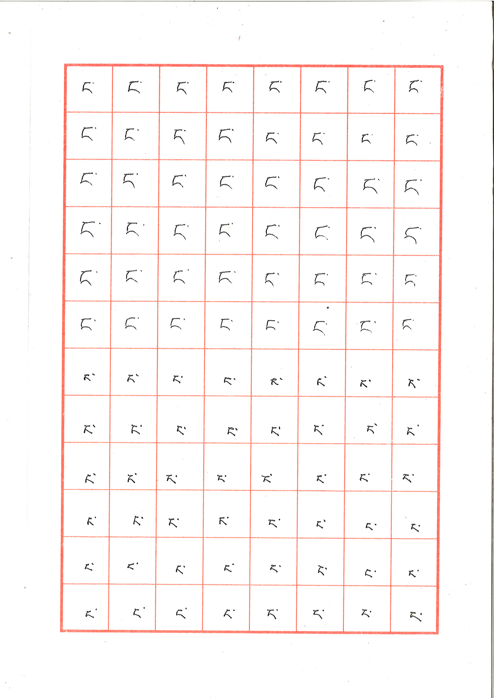
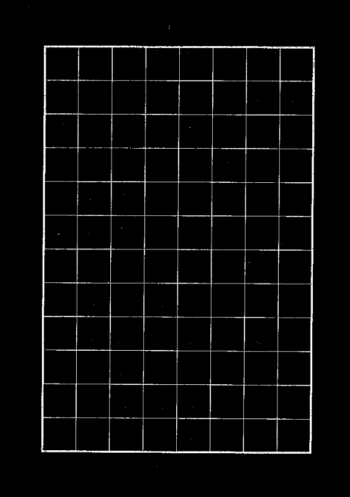
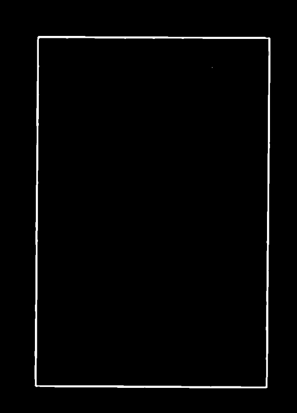
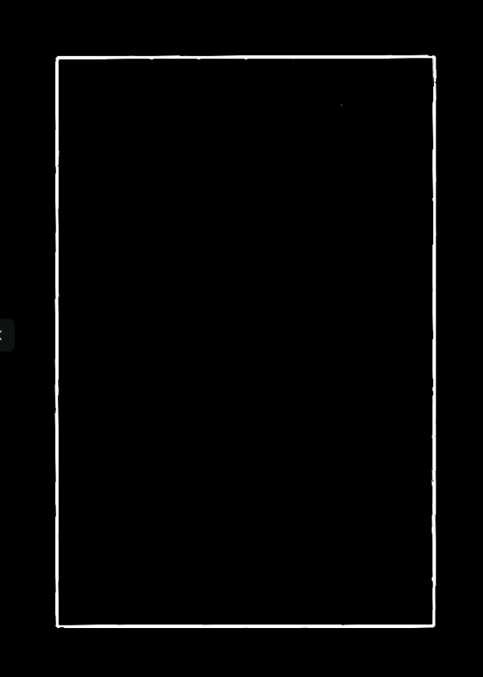
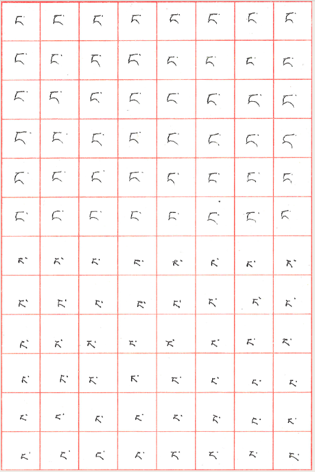
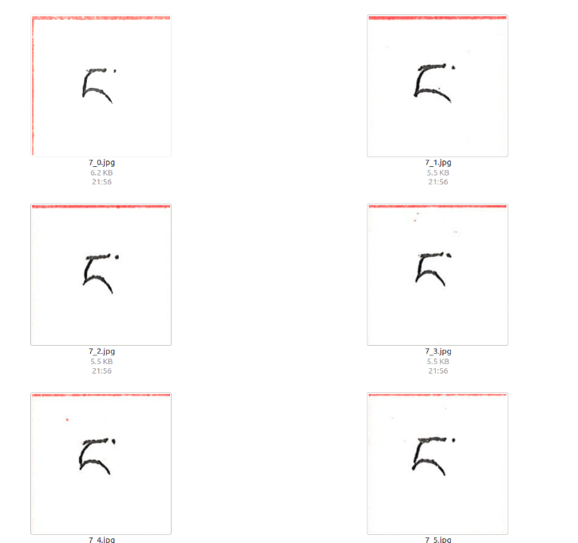
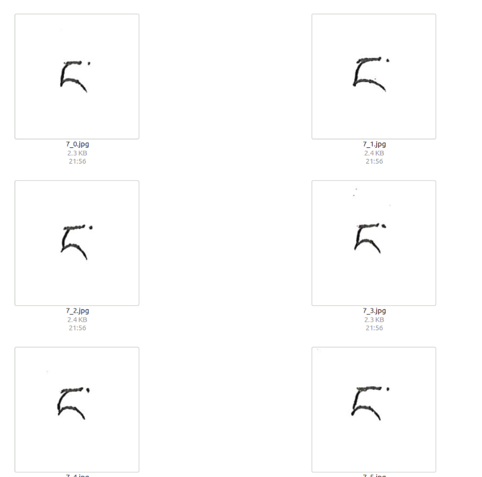

> **项目资源**
>
> 📊 数据集：[百度网盘](https://pan.baidu.com/s/1TnM9Rxue9ae0bhPJ2EUP8g?pwd=4ata)（提取码：`4ata`）
>
> 💻 项目代码：[cairangxianmu/tibetan-hwr](https://github.com/cairangxianmu/tibetan-hwr)
>
> 🌐 Web 演示：（即将上线）
>
> 📄 论文：[DOI 10.16229/j.cnki.issn1001-7542.2019.04.006](https://doi.org/10.16229/j.cnki.issn1001-7542.2019.04.006)

## 一、项目概述

手写藏文字母识别是一项具有民族特色的任务，藏文字母笔画复杂、书写风格多样，目前没有相关公开数据集。本项目是藏文字母识别系统的图像预处理模块，负责将志愿者手写并扫描的表格型文字图像自动处理为可供模型训练的单字母图像。

表格采用红色框线划分格子，每个格子内手写一个藏文字母。图像预处理需要完成以下工作：提取红色框线定位表格区域、矫正扫描时产生的倾斜偏差、按格子裁剪并批量保存各字母图像，最终消除残余的红色噪声。

**项目构成：**

- `main.py`：主流程，读取扫描图像，依次执行颜色提取、滤波、直线检测、轮廓定位、旋转矫正、裁剪保存
- `replace.py`：后处理，逐像素替换残余红色框线为白色背景

## 二、依赖安装

```bash
pip install numpy opencv-python pillow
```

## 三、图像处理流程

原始图像如下，为带有红色格线的手写表格：



---

### 1. HSV 颜色提取

`separate_color_red` 函数提取图像中的红色框线。将图像从 BGR 转换为 HSV 色彩空间后，通过 `cv2.inRange` 指定颜色范围进行掩膜提取。

> **HSV 颜色范围参考**：[点击查看各颜色 HSV 分量范围](https://blog.csdn.net/u013270326/article/details/80704754)

**函数说明：`cv2.inRange(hsv, lowerb, upperb)`**

| 参数     | 说明                          |
| -------- | ----------------------------- |
| `hsv`    | 输入图像，需先转换为 HSV 格式 |
| `lowerb` | H、S、V 分量的最低值          |
| `upperb` | H、S、V 分量的最高值          |

```python
hsv = cv2.cvtColor(img, cv2.COLOR_BGR2HSV)  # 转换为 HSV 色彩空间
lower_hsv = np.array([0, 43, 46])            # 红色 HSV 下界
high_hsv  = np.array([10, 255, 255])         # 红色 HSV 上界
mask = cv2.inRange(hsv, lowerb=lower_hsv, upperb=high_hsv)
```

提取效果：



---

### 2. 中值滤波

`medianBlur` 用于过滤掉除最外层框线以外的噪声线条，保留主体轮廓。

**函数说明：`cv2.medianBlur(img, ksize)`**

| 参数    | 说明                                              |
| ------- | ------------------------------------------------- |
| `img`   | 输入图像                                          |
| `ksize` | 滤波核大小，必须为大于 1 的奇数（如 3、5、7、19） |

```python
mediu = cv2.medianBlur(img, 19)
```

滤波效果：



---

### 3. 概率霍夫直线检测

调用 `HoughLinesP` 前需先执行 Canny 边缘检测，将图像二值化。

**`cv2.Canny(img, threshold1, threshold2)`**

| 参数         | 说明                     |
| ------------ | ------------------------ |
| `threshold1` | 低阈值，用于连接间断边缘 |
| `threshold2` | 高阈值，用于检测明显边缘 |

**`cv2.HoughLinesP(img, rho, theta, threshold, lines, minLineLength, maxLineGap)`**

| 参数            | 说明                                     |
| --------------- | ---------------------------------------- |
| `img`           | 输入图像，须为 Canny 边缘检测后的二值图  |
| `rho`           | 直线半径精度，建议设为 1                 |
| `theta`         | 角度步长，通常为 `np.pi / 180`           |
| `threshold`     | 累加器阈值                               |
| `minLineLength` | 最短直线长度，短于此值的直线被忽略       |
| `maxLineGap`    | 同一直线上点的最大间隔，超过则视为两条线 |

```python
img_canny = cv2.Canny(img, 20, 250)
lines = cv2.HoughLinesP(
    img_canny, 1, np.pi / 180, 120,
    lines=4, minLineLength=50, maxLineGap=150
)
lines1 = lines[:, 0, :]  # 降维处理
for x1, y1, x2, y2 in lines1:
    cv2.line(img, (x1, y1), (x2, y2), (255, 255, 255), 2)
```

---

### 4. 轮廓检测

`findContours` 用于检测最外层矩形框，并获取其偏转角度，供后续旋转矫正使用。

**`cv2.findContours(img, mode, method)`**

| 参数     | 可选值                    | 说明                          |
| -------- | ------------------------- | ----------------------------- |
| `mode`   | `cv2.RETR_EXTERNAL`       | 只检测最外层轮廓              |
|          | `cv2.RETR_LIST`           | 检测所有轮廓，不建立层级关系  |
|          | `cv2.RETR_CCOMP`          | 建立两层轮廓（外边界 + 内孔） |
|          | `cv2.RETR_TREE`           | 建立完整层级树                |
| `method` | `cv2.CHAIN_APPROX_NONE`   | 存储所有轮廓点                |
|          | `cv2.CHAIN_APPROX_SIMPLE` | 只保留方向端点，压缩冗余点    |

```python
image, contours, hier = cv2.findContours(
    img, cv2.RETR_EXTERNAL, cv2.CHAIN_APPROX_SIMPLE
)
for c in contours:
    rect  = cv2.minAreaRect(c)   # 最小外接矩形
    box_  = cv2.boxPoints(rect)
    h = abs(box_[3, 1] - box_[1, 1])
    w = abs(box_[3, 0] - box_[1, 0])

    # 过滤掉不符合尺寸的轮廓
    if h > 3000 or w > 2200:
        continue
    if h < 2500 or w < 1500:
        continue

    box   = np.int0(cv2.boxPoints(rect))
    angle = rect[2]

    # 角度归一化到 [0, 45] 范围
    if abs(angle) > 45:
        angle = 90 - abs(angle)
```

---

### 5. 旋转矫正

将倾斜的图像旋转至水平方向。

**`cv2.getRotationMatrix2D(center, angle, scale)`**

| 参数     | 说明                       |
| -------- | -------------------------- |
| `center` | 旋转基点（通常为图像中心） |
| `angle`  | 旋转角度                   |
| `scale`  | 缩放因子，1 表示不缩放     |

**`cv2.warpAffine(img, M, dsize)`**

| 参数    | 说明                                    |
| ------- | --------------------------------------- |
| `M`     | 由 `getRotationMatrix2D` 得到的变换矩阵 |
| `dsize` | 输出图像尺寸 `(width, height)`          |

```python
(h, w) = img.shape[:2]
center = (w // 2, h // 2)
M = cv2.getRotationMatrix2D(center, angle, 1)
rotated = cv2.warpAffine(img, M, (w, h))
```

矫正效果：



---

### 6. 图像裁剪

沿外层矩形框裁剪：



```python
# 利用轮廓坐标裁剪
x1, y1 = box[1]
x2, y2 = box[3]
img_cut = img[y1 + 10:y2 - 10, x1 + 10:x2 - 10]
```

按格子裁剪并批量保存：

```python
# 数组切片裁剪（需用 cv2.imread 加载图像）
img[y1:y2, x1:x2]
```

裁剪效果：



---

### 7. 消除多余红色框线

使用 PIL 逐像素替换，将红色像素替换为白色。

> **注意**：此操作须使用 `Image.open()` 加载图像，而非 `cv2.imread()`。

```python
from PIL import Image

img2 = Image.open(path)
img2 = img2.convert('RGBA')
pixdata = img2.load()

for y in range(img2.size[1]):
    for x in range(img2.size[0]):
        if pixdata[x, y][0] > 220:  # 判断为红色像素
            pixdata[x, y] = (255, 255, 255, 255)  # 替换为白色

img2 = img2.convert('RGB')
img2.save(path)
```

处理效果：



---

## 四、完整代码

### 1. main.py

```python
import cv2
import numpy as np
import os
import replace


def separate_color_red(img):
    """提取图像中的红色区域（HSV 颜色提取）"""
    hsv = cv2.cvtColor(img, cv2.COLOR_BGR2HSV)
    lower_hsv = np.array([0, 43, 46])
    high_hsv  = np.array([10, 255, 255])
    mask = cv2.inRange(hsv, lowerb=lower_hsv, upperb=high_hsv)
    print("颜色提取完成")
    return mask


def salt(img, n):
    """椒盐噪声滤波"""
    for k in range(n):
        i = int(np.random.random() * img.shape[1])
        j = int(np.random.random() * img.shape[0])
        if img.ndim == 2:
            img[j, i] = 255
        elif img.ndim == 3:
            img[j, i, 0] = 255
            img[j, i, 1] = 255
            img[j, i, 2] = 255
    return img


def cut(img, box, label, save_path):
    """按格子裁剪并保存图像"""
    x1, y1 = box[1]
    x2, y2 = box[3]
    img_cut = img[y1 + 10:y2 - 10, x1 + 10:x2 - 10]

    row = 8   # 行数
    col = 12  # 列数
    h, w = img_cut.shape[:2]
    cell_h = h // row
    cell_w = w // col

    os.makedirs(save_path, exist_ok=True)
    for r in range(row):
        for c in range(col):
            cell = img_cut[r * cell_h:(r + 1) * cell_h,
                           c * cell_w:(c + 1) * cell_w]
            filename = os.path.join(save_path, f"{label}_{r}_{c}.png")
            cv2.imwrite(filename, cell)
            replace.replace_red(filename)


def process(img_path, label, save_path):
    img = cv2.imread(img_path)
    # 1. 颜色提取
    mask = separate_color_red(img)
    # 2. 中值滤波
    mediu = cv2.medianBlur(mask, 19)
    # 3. 霍夫直线检测
    img_canny = cv2.Canny(mediu, 20, 250)
    lines = cv2.HoughLinesP(img_canny, 1, np.pi / 180, 120,
                            lines=4, minLineLength=50, maxLineGap=150)
    if lines is None:
        print(f"[警告] 未检测到直线：{img_path}")
        return
    lines1 = lines[:, 0, :]
    for x1, y1, x2, y2 in lines1:
        cv2.line(mediu, (x1, y1), (x2, y2), (255, 255, 255), 2)
    # 4. 轮廓检测
    _, contours, _ = cv2.findContours(
        mediu, cv2.RETR_EXTERNAL, cv2.CHAIN_APPROX_SIMPLE)
    for c in contours:
        rect  = cv2.minAreaRect(c)
        box_  = cv2.boxPoints(rect)
        h = abs(box_[3, 1] - box_[1, 1])
        w = abs(box_[3, 0] - box_[1, 0])
        if h > 3000 or w > 2200:
            continue
        if h < 2500 or w < 1500:
            continue
        box   = np.int0(cv2.boxPoints(rect))
        angle = rect[2]
        if abs(angle) > 45:
            angle = 90 - abs(angle)
        # 5. 旋转矫正
        (ih, iw) = img.shape[:2]
        center = (iw // 2, ih // 2)
        M = cv2.getRotationMatrix2D(center, angle, 1)
        rotated = cv2.warpAffine(img, M, (iw, ih))
        # 6. 裁剪并保存
        cut(rotated, box, label, save_path)


if __name__ == "__main__":
    import sys
    img_path  = sys.argv[1]
    label     = sys.argv[2]
    save_path = sys.argv[3]
    process(img_path, label, save_path)
```

### 2. replace.py

```python
from PIL import Image


def replace_red(path):
    """将图像中的红色像素替换为白色"""
    img = Image.open(path).convert('RGBA')
    pixdata = img.load()
    for y in range(img.size[1]):
        for x in range(img.size[0]):
            r, g, b, a = pixdata[x, y]
            if r > 220 and g < 100 and b < 100:
                pixdata[x, y] = (255, 255, 255, 255)
    img.convert('RGB').save(path)
```

## 五、小结

通过七步流水线——HSV 颜色提取、中值滤波、霍夫直线检测、轮廓检测、旋转矫正、图像裁剪、红色框线消除——将志愿者手写扫描表格图像自动转化为标准化单字母图像（64×64 灰度图），构成了 TibetanLetter 数据集的基础。这批图像可直接用于卷积神经网络训练，详见系列三：CNN 训练与 Web 部署。
