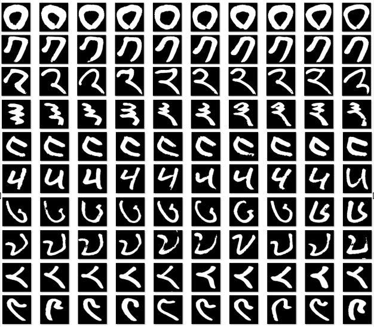
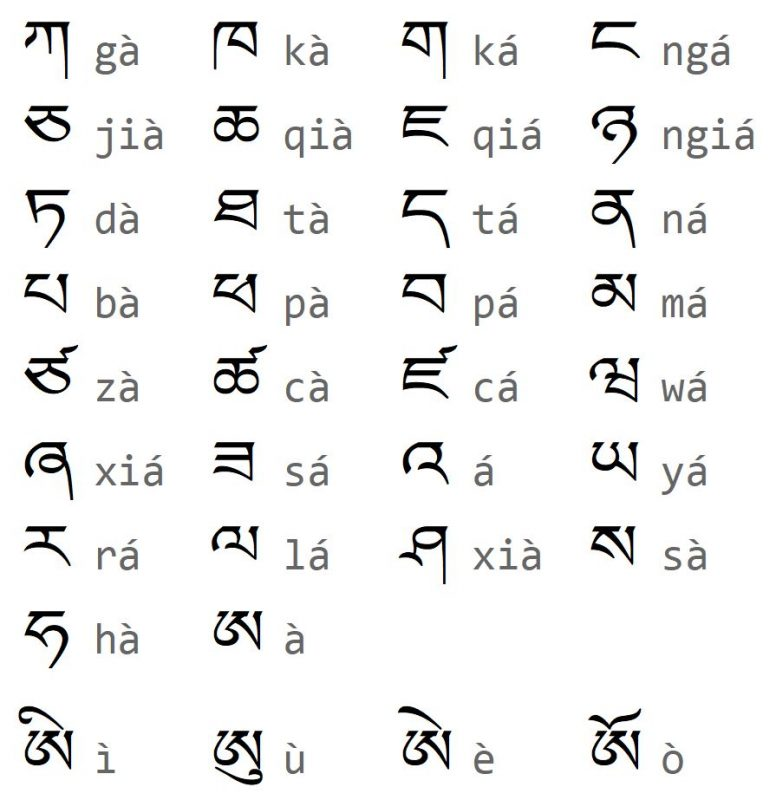
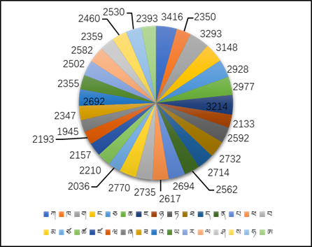
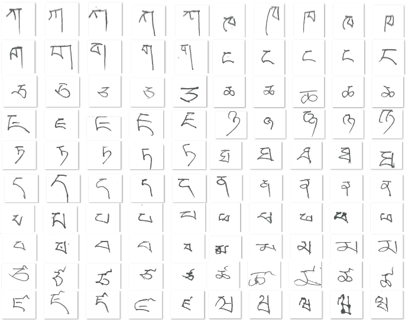

> **项目资源**
>
> 📊 数据集：[百度网盘](https://pan.baidu.com/s/1TnM9Rxue9ae0bhPJ2EUP8g?pwd=4ata)（提取码：`4ata`）
>
> 💻 项目代码：[cairangxianmu/tibetan-hwr](https://github.com/cairangxianmu/tibetan-hwr)
>
> 🌐 Web 演示：[cairangxianmu-tibetan-hwr.hf.space](https://cairangxianmu-tibetan-hwr.hf.space)
>
> 📄 论文：[DOI 10.16229/j.cnki.issn1001-7542.2019.04.006](https://doi.org/10.16229/j.cnki.issn1001-7542.2019.04.006)

## 一、项目简介

本文介绍两个专为藏文手写体识别任务构建的开源数据集：

- **TibetanMNIST**：藏文手写数字数据集，共 **17768** 张图像，涵盖藏文 0–9 共 10 个数字类别
- **TibetanLetter**：藏文手写字母数据集，共 **77636** 张图像，覆盖 30 个藏文辅音字母

两个数据集均由本人在本科期间带队制作，是目前为数不多的藏文手写体公开数据集，填补了该领域数据空白，适合用于藏文识别相关的机器学习入门任务。

|          |  TibetanMNIST  | TibetanLetter  |
| :------- | :------------: | :------------: |
| 类别数   | 10（数字 0–9） | 30（辅音字母） |
| 样本数   |     17,768     |     77,636     |
| 图像尺寸 |     28×28      |     64×64      |
| 通道     |     灰度图     |     灰度图     |

## 二、背景与起源

### 2.1 从 MNIST 到 TibetanMNIST

MNIST 数据集是机器学习领域的里程碑——由美国国家标准与技术研究所（NIST）发起，收录了 250 位书写者的手写数字，自发布以来被广泛用于检验各类算法，推动了机器学习领域的长足发展，当之无愧是历史上最具影响力的数据集之一。

然而，现有手写体数据集几乎清一色面向英文、中文、阿拉伯文等强势语言，少数民族语言的数据资源极度匮乏。藏文作为拥有数百万使用者的语言，在公开数据集层面几乎是空白。这一现状不仅限制了藏文智能输入、文档数字化等实际应用的发展，也使藏文相关的学术研究举步维艰。

TibetanMNIST 正是在这一背景下诞生的。数据集按照 MNIST 的格式规范制作，图像尺寸同为 28×28 像素灰度图，可直接套用为 MNIST 设计的模型框架进行训练，大大降低了研究者的上手门槛。书写者为本校藏族同学，经过严格的质量筛选，最终整理出 17768 张高清图像——**据我们所知，这是全球第一个公开的藏文手写数字图像数据集**。

### 2.2 从数字到字母的扩展

数字数据集的顺利完成，让团队看到了进一步拓展的可能。藏文数字仅有 10 个类别，而藏文字母有 30 个辅音字母，是构成藏文文本的核心单元，其识别难度与应用价值都更高。

为此，我们组织了更大规模的数据采集：邀请本校 **150 名藏族大学生**参与手写，在统一规范的方格纸上书写全部 30 个辅音字母，原始采集量约 100000 例。经人工逐一核查清洗后，最终形成 **TibetanLetter** 数据集，包含 77636 张 64×64 像素的标准化字母图像。

两个数据集合并发布，统称 **TibetanCharacter**，希望为藏文手写体识别研究提供一个坚实的数据基础。

## 三、TibetanMNIST 数字数据集

### 3.1 藏文数字介绍

藏文数字是藏语书写体系中独立使用的计数符号，与阿拉伯数字一一对应，共 10 个，分别表示 0 到 9。它们并非藏文字母的一部分，而是在语言中单独成体，形态简洁、笔画清晰，具有较高的可辨识度。从字形上看，藏文数字自成风格，与汉字数字或阿拉伯数字均无直接渊源，是藏族文化中独特的符号系统：

| 阿拉伯数字 | 藏文数字 | 阿拉伯数字 | 藏文数字 |
| :--------: | :------: | :--------: | :------: |
|     0      |    ༠     |     5      |    ༥     |
|     1      |    ༡     |     6      |    ༦     |
|     2      |    ༢     |     7      |    ༧     |
|     3      |    ༣     |     8      |    ༨     |
|     4      |    ༤     |     9      |    ༩     |

### 3.2 数据采集

数据采集以纸质手写为主，书写者涵盖学生与研究人员。为保证样本质量，我们对书写规范做了统一要求：字体大小须适中、笔画完整清晰、书写在规定区域内，避免连笔或涂改。

采集完成后，所有原始图像均经过扫描数字化，再由团队成员对每张图像进行人工复核，经过 300 余次人工筛选，剔除书写不规范、字迹模糊、尺寸异常等无效样本，最终保留 **17768** 例有效图像，平均每个类别约 1777 张。

### 3.3 类别分布

10 个数字类别整体分布较为均衡，每类约 1300–2100 张，无明显类别失衡问题，可直接用于有监督学习训练，无需额外做类别重采样：


### 3.4 数据示例

下图展示了每个类别的若干手写样本，可以看到不同书写者在笔画风格、粗细、倾斜程度上存在自然差异，这正是手写体识别的挑战所在：



> **原始图像命名规则：** `{类别标签}_{纸张编号}_{纸张内序号}.png`，例如 `3_12_05.png` 表示数字 3、第 12 张纸、第 5 个样本。

## 四、TibetanLetter 字母数据集

### 4.1 藏文字母介绍

藏文是一种拼音文字，其书写体系由**辅音字母**与**元音符号**组合而成。现代藏文共有 30 个辅音字母和 4 个元音符号，书写时以辅音字母为基础，通过垂直方向的叠加（上加字、下加字）和水平方向的拼接（前加字、后加字、再后加字），加上元音符号构成一个完整的藏文音节。

每个音节在视觉上呈现为一个紧凑的字块，结构层次丰富，书写风格因人而异，这也使得藏文手写体识别在技术上颇具挑战性。本数据集聚焦于最基本的构成单元，收录了手写形式的 **30 个辅音字母**：



### 4.2 数据采集

为保证数据一致性，我们统一制定了书写规范：书写载体为**红色格线方格纸**（8 行 × 12 列），每格书写一个字母，通过格线约束个体书写差异，保证字母大小和位置相对一致。

共有本校 **150 名藏族大学生**参与书写，每人完成全部 30 个字母的书写任务，采集原始样本约 100000 例。所有纸张经高精度扫描后，由团队成员对每个字母图像进行逐一核查，删除字迹不清、书写越格、字母混淆等无效样本，最终保留有效数据 **77636** 例。

### 4.3 类别分布

30 个字母类别分布相对均衡，每类约 2000 余个样本。少数字母因字形复杂、书写难度较高，有效率略低于其他类别，但整体样本量仍可满足模型训练需求：



### 4.4 数据示例

下图为部分藏文辅音字母的手写样本展示，每行对应一个字母类别，可以直观看到同一字母在不同书写者手下的风格差异：



### 4.5 图像预处理

由于书写纸张使用红色格线，原始扫描图像中格线与字母内容混叠，无法直接使用。我们设计了如下自动化预处理流程，将原始整张纸面图像切分并标准化为单张字母图像：

```
原始扫描图像
  ↓ HSV 颜色提取（分离红色格线）
  ↓ 中值滤波（去除噪声线条）
  ↓ 轮廓检测（定位字母区域）
  ↓ 字母提取（裁剪单个字母）
  ↓ 统一尺寸（归一化图像大小）
最终输出：标准化字母图像（64×64 灰度图）
```

其中，HSV 颜色空间下对红色通道的精准提取是关键步骤——红色在 HSV 空间中分布在色调（H）的两端，需要分段掩膜合并处理。轮廓检测基于 OpenCV 的外轮廓提取，结合面积与长宽比过滤，排除杂点干扰，准确定位每个字母单元格。

具体实现细节见：[TibetanHWR 系列二：图像预处理](/posts/tibetan-character-recognition/tibetan-character-data-process/index)

## 五、小结

TibetanCharacter 数据集由 TibetanMNIST（17,768 张手写数字）与 TibetanLetter（77,636 张手写字母）两部分组成，填补了藏文手写体公开数据集的空白。系列后续两篇将分别介绍如何用 Python + OpenCV 对原始扫描图进行自动化预处理（系列二），以及如何训练 CNN 模型并部署为 Web 在线演示（系列三）。

## 六、引用

如在研究中使用本数据集，请引用以下论文：

> 周毛克,才让先木,龙从军,等.基于卷积神经网络的藏文手写数字和字母识别研究[J].青海师范大学学报(自然科学版),2019,35(04):34-39.DOI:10.16229/j.cnki.issn1001-7542.2019.04.006.

```bibtex
@article{zhou2019tibetan,
  title   = {基于卷积神经网络的藏文手写数字和字母识别研究},
  author  = {周毛克 and 才让先木 and 龙从军 and others},
  journal = {青海师范大学学报(自然科学版)},
  volume  = {35},
  number  = {04},
  pages   = {34--39},
  year    = {2019},
  doi     = {10.16229/j.cnki.issn1001-7542.2019.04.006}
}
```
