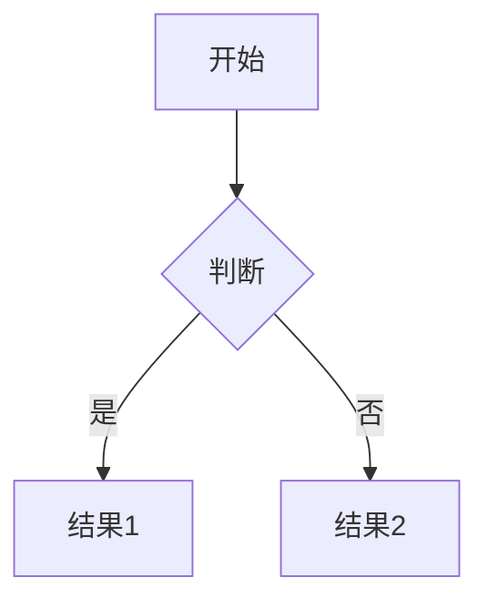

# 若风博客 · 个人定制指南

> 基于 Firefly Astro 博客主题，快速打造专属个人博客的完整操作手册。

---

## 一、快速启动

```bash
# 安装依赖
pnpm install

# 启动开发服务器（实时预览修改效果）
pnpm dev

# 构建生产版本
pnpm build

# 预览构建结果
pnpm preview

# 新建文章
pnpm new-post
```

开发服务器启动后访问：`http://localhost:4321`

---

## 二、定制优先级（建议按此顺序逐步完成）

| 优先级 | 配置项 | 文件路径 | 预计耗时 |
|--------|--------|----------|----------|
| ⭐⭐⭐ 必做 | 站点基础信息 | `src/config/siteConfig.ts` | 10 分钟 |
| ⭐⭐⭐ 必做 | 个人资料 | `src/config/profileConfig.ts` | 5 分钟 |
| ⭐⭐⭐ 必做 | 导航栏 | `src/config/navBarConfig.ts` | 10 分钟 |
| ⭐⭐⭐ 必做 | 删除示例文章 / 写第一篇文章 | `src/content/posts/` | 30 分钟+ |
| ⭐⭐ 建议 | 背景壁纸 | `src/config/backgroundWallpaper.ts` | 15 分钟 |
| ⭐⭐ 建议 | 公告 | `src/config/announcementConfig.ts` | 5 分钟 |
| ⭐⭐ 建议 | 关于页面 | `src/content/spec/about.md` | 20 分钟 |
| ⭐⭐ 建议 | 友链 | `src/config/friendsConfig.ts` | 10 分钟 |
| ⭐ 可选 | 评论系统 | `src/config/commentConfig.ts` | 30 分钟 |
| ⭐ 可选 | 音乐播放器 | `src/config/musicConfig.ts` | 20 分钟 |
| ⭐ 可选 | 赞助配置 | `src/config/sponsorConfig.ts` | 10 分钟 |

---

## 三、核心配置详解

### 3.1 站点基础配置 `src/config/siteConfig.ts`

这是最重要的配置文件，控制网站全局信息：

```typescript
export const siteConfig: SiteConfig = {
  title: "若风的博客",          // 网站标题（显示在浏览器标签页）
  subtitle: "清风浩渺，如梦如幻",// 副标题（显示在首页横幅）
  lang: "zh_CN",               // 语言（zh_CN / zh_TW / en / ja / ru）
  themeColor: {
    hue: 210,                  // 主题色色相（0-360，210=蓝色）
    fixed: false,              // false=允许用户自行切换主题色
  },
  banner: {
    enable: true,
    src: "assets/images/DesktopWallpaper/1.jpg", // 横幅背景图
    position: "center",        // 图片对齐位置
    credit: {
      enable: true,
      text: "摄影：若风",       // 图片来源说明
      url: "",
    },
  },
  toc: {
    enable: true,              // 开启文章目录
    depth: 3,                  // 目录最大层级（h1~h3）
  },
  favicon: [                   // 网站图标（放在 public/favicon/ 目录）
    { src: "/favicon/favicon-32x32.png", theme: "light", sizes: "32x32" },
    { src: "/favicon/favicon-dark.png",  theme: "dark",  sizes: "32x32" },
  ],
}
```

**主题色参考**：
- 210 = 蓝色（默认）
- 150 = 绿色
- 30  = 橙色
- 280 = 紫色
- 0   = 红色

---

### 3.2 个人资料配置 `src/config/profileConfig.ts`

控制左侧边栏的个人名片：

```typescript
export const profileConfig: ProfileConfig = {
  avatar: "/assets/images/avatar.svg",  // 以 / 开头→从 public/ 目录读取
  name: "若风",
  bio: "清风浩渺，从心出发",           // 个人签名
  links: [
    {
      name: "GitHub",
      icon: "fa7-brands:github",
      url: "https://github.com/你的用户名",
      showName: false,
    },
    {
      name: "Email",
      icon: "fa7-solid:envelope",
      url: "mailto:你的邮箱@example.com", // 注意加 mailto:
      showName: false,
    },
    // 更多图标访问：https://icones.js.org/
  ],
}
```

**常用社交平台图标**：

| 平台 | 图标代码 |
|------|---------|
| GitHub | `fa7-brands:github` |
| 微博 | `fa7-brands:weibo` |
| 微信 | `fa7-brands:weixin` |
| Twitter/X | `fa7-brands:x-twitter` |
| bilibili | `simple-icons:bilibili` |
| 知乎 | `simple-icons:zhihu` |
| 邮件 | `fa7-solid:envelope` |
| RSS | `fa7-solid:rss` |

---

### 3.3 导航栏配置 `src/config/navBarConfig.ts`

控制顶部导航菜单：

```typescript
export const navBarConfig: NavBarConfig = {
  links: [
    {
      name: "首页",
      url: "/",
      external: false,
    },
    {
      name: "归档",
      url: "/archive",
    },
    {
      name: "关于",
      url: "/about",
    },
    {
      name: "友链",
      url: "/friends",
    },
    {
      name: "相册",
      url: "/gallery",
    },
    // 可以添加外部链接
    {
      name: "GitHub",
      url: "https://github.com/你的用户名",
      external: true,          // 在新标签页打开
    },
  ],
}
```

---

### 3.4 背景壁纸配置 `src/config/backgroundWallpaper.ts`

控制网站背景图片和横幅动态文字：

```typescript
export const backgroundWallpaperConfig = {
  // 壁纸模式：
  // "disabled"  - 不显示壁纸
  // "static"    - 静态单张壁纸
  // "slideshow" - 幻灯片轮播壁纸
  mode: "slideshow",

  // 静态壁纸（mode="static" 时使用）
  src: "assets/images/DesktopWallpaper/1.jpg",

  // 幻灯片壁纸列表（mode="slideshow" 时使用）
  slideshowList: [
    { src: "assets/images/DesktopWallpaper/1.jpg" },
    { src: "assets/images/DesktopWallpaper/2.jpg" },
    // 添加你自己的壁纸图片
  ],

  // 横幅动态打字文字列表
  bannerTextList: [
    "清风浩渺，从心出发",
    "若风，如梦如幻",
    "愿以诗意栖居",
  ],
}
```

**壁纸图片建议**：
- 放在 `public/assets/images/DesktopWallpaper/`（PC端）
- 放在 `public/assets/images/MobileWallpaper/`（移动端）
- 推荐分辨率：1920×1080 或更高
- 格式：webp / avif（体积小，画质好）

---

### 3.5 公告配置 `src/config/announcementConfig.ts`

侧边栏公告栏内容：

```typescript
export const announcementConfig: AnnouncementConfig = {
  enable: true,
  title: "公告",
  content: `
    欢迎来到若风的博客！<br>
    这里记录我的思考与成长。<br>
    <a href="/about">了解更多关于我</a>
  `,
}
```

---

## 四、写博客文章

### 4.1 新建文章（推荐方式）

```bash
pnpm new-post
```

按提示输入文章标题，会自动生成文件。

### 4.2 手动创建

在 `src/content/posts/` 目录下新建 `.md` 文件：

```markdown
---
title: 我的第一篇文章
published: 2026-01-01
description: 这是文章摘要，显示在文章列表中
image: ./images/cover.jpg     # 封面图（可选）
tags: [随笔, 生活]
category: 随笔
draft: false                  # true=草稿，不会发布
pinned: false                 # true=置顶
---

正文从这里开始，支持标准 Markdown 语法。

## 二级标题

**粗体**、*斜体*、`行内代码`

\`\`\`python
print("Hello, World!")
\`\`\`
```

### 4.3 文章 Frontmatter 完整参数

| 参数 | 类型 | 必须 | 说明 |
|------|------|------|------|
| `title` | string | ✅ | 文章标题 |
| `published` | date | ✅ | 发布日期 `YYYY-MM-DD` |
| `description` | string | | 文章摘要 |
| `image` | string | | 封面图路径 |
| `tags` | string[] | | 标签列表 |
| `category` | string | | 分类名称 |
| `draft` | boolean | | 是否为草稿（默认 false） |
| `updated` | date | | 最后更新日期 |
| `pinned` | boolean | | 是否置顶（默认 false） |
| `lang` | string | | 语言（如 `en`） |
| `comment` | boolean | | 是否开启评论（默认 true） |
| `password` | string | | 文章密码（加密保护） |
| `passwordHint` | string | | 密码提示 |

### 4.4 Markdown 进阶语法

**提示框（Callout）**：
```markdown
> [!NOTE]
> 这是一个提示信息

> [!WARNING]
> 这是一个警告信息

> [!TIP]
> 这是一个小技巧
```

**图片网格**：
```markdown
 
 
```

**数学公式（KaTeX）**：
```markdown
行内公式：$E = mc^2$

独立公式：
$$
\int_{-\infty}^{\infty} e^{-x^2} dx = \sqrt{\pi}
$$
```

**Mermaid 流程图**：
````markdown

````

---

## 五、页面定制

### 5.1 关于页面 `src/content/spec/about.md`

编辑个人介绍，支持完整 Markdown 和 HTML。建议包含：
- 自我介绍（个人经历、兴趣爱好）
- 技能/专业领域
- 联系方式
- 时间线/里程碑

### 5.2 友链页面 `src/config/friendsConfig.ts`

```typescript
export const friendsConfig: FriendsConfig = {
  groups: [
    {
      title: "博友",
      friends: [
        {
          name: "朋友的名字",
          url: "https://friend-blog.com",
          avatar: "https://friend-blog.com/avatar.png",
          description: "这是我的好朋友",
        },
      ],
    },
  ],
}
```

### 5.3 留言板 `src/content/spec/guestbook.md`

编辑留言板页面的说明文字，评论区由评论系统提供。

---

## 六、图片与资源管理

### 6.1 图片存放位置

| 用途 | 推荐路径 | 访问方式 |
|------|----------|----------|
| 头像 | `public/assets/images/avatar.svg` | `/assets/images/avatar.svg` |
| 壁纸（PC） | `public/assets/images/DesktopWallpaper/` | 在配置中填写相对路径 |
| 壁纸（移动） | `public/assets/images/MobileWallpaper/` | 在配置中填写相对路径 |
| 文章封面 | 文章目录下，如 `src/content/posts/文章名/cover.jpg` | `./cover.jpg`（相对路径）|
| 文章图片 | `src/content/posts/文章名/images/` | `./images/图片名.jpg` |
| 相册图片 | `public/gallery/相册名/` | 在 galleryConfig.ts 中配置 |

### 6.2 图片格式建议

- **头像**：SVG（矢量，无限缩放）或 WebP（小体积）
- **封面图**：WebP 或 AVIF（压缩率最高）
- **壁纸**：WebP，分辨率 1920×1080
- 推荐使用 [Squoosh](https://squoosh.app) 压缩图片

### 6.3 网站图标（Favicon）

将图标文件放入 `public/favicon/` 目录，推荐准备：
- `favicon.ico`（兼容性）
- `favicon-32x32.png`（浅色主题）
- `favicon-dark.png`（深色主题）
- `apple-touch-icon.png`（iOS 桌面图标，180×180）

---

## 七、功能开关

### 7.1 评论系统 `src/config/commentConfig.ts`

支持：Twikoo、Waline、Giscus、Disqus、Artalk

**推荐使用 Twikoo（国内友好）**：
1. 部署 Twikoo 云函数（参考官方文档：twikoo.sonofmagic.dev）
2. 填入环境 ID：
```typescript
export const commentConfig: CommentConfig = {
  provider: "twikoo",
  twikooConfig: {
    envId: "你的Twikoo环境ID",
  },
}
```

**Giscus（基于 GitHub Discussions，国际用户友好）**：
1. 访问 giscus.app 生成配置
2. 填入对应参数

### 7.2 音乐播放器 `src/config/musicConfig.ts`

**使用 Meting API（网易云/QQ音乐等）**：
```typescript
export const musicConfig: MusicConfig = {
  enable: true,
  provider: "meting",
  metingConfig: {
    api: "https://api.example.com/",  // Meting API 地址
    id: "你的歌单ID",
    server: "netease",  // netease / tencent / kugou
    type: "playlist",
    autoplay: false,
  },
}
```

### 7.3 樱花特效 `src/config/sakuraConfig.ts`

```typescript
export const sakuraConfig: SakuraConfig = {
  enable: true,        // 是否开启
  count: 20,           // 花瓣数量
  speed: 1,            // 下落速度（0.5~2）
  size: { min: 8, max: 16 },  // 花瓣大小范围
}
```

### 7.4 相册 `src/config/galleryConfig.ts`

```typescript
export const galleryConfig: GalleryConfig = {
  albums: [
    {
      id: "travel-2026",       // 对应 public/gallery/travel-2026/ 目录
      title: "旅行 2026",
      description: "记录旅途中的美好瞬间",
      cover: "01.jpg",         // 封面图文件名
    },
  ],
}
```

---

## 八、SEO 优化

### 8.1 在 `src/config/siteConfig.ts` 中配置

```typescript
export const siteConfig = {
  title: "若风的博客",
  // 建议格式：内容描述 + 作者名
  description: "若风的个人博客，分享技术、生活与思考",
  url: "https://你的域名.com",  // 生产环境域名（影响 sitemap 和 OG 图片）
}
```

### 8.2 文章 SEO

- 每篇文章填写 `description`（文章摘要）
- 合理设置 `tags` 和 `category`
- 为文章设置封面图（影响社交分享预览）

---

## 九、部署

### 9.1 Vercel（推荐，国内访问较快）

1. 将项目推送到 GitHub
2. 登录 [vercel.com](https://vercel.com)，导入项目
3. 构建命令：`pnpm build`，输出目录：`dist`
4. 部署完成后绑定自定义域名

### 9.2 GitHub Pages

```bash
# 构建
pnpm build

# 将 dist/ 目录推送到 gh-pages 分支
```

项目已包含 `.github/workflows/deploy.yml`，配置好后自动部署。

### 9.3 Cloudflare Pages

1. 登录 Cloudflare Dashboard → Pages
2. 连接 GitHub 仓库
3. 构建命令：`pnpm build`，输出：`dist`

---

## 十、文件结构速查

```
RuofengFirefly/
├── src/
│   ├── config/              # 🔧 所有配置文件（主要修改区域）
│   │   ├── siteConfig.ts       站点基础配置
│   │   ├── profileConfig.ts    个人资料
│   │   ├── navBarConfig.ts     导航栏
│   │   ├── sidebarConfig.ts    侧边栏布局
│   │   ├── backgroundWallpaper.ts 背景壁纸
│   │   ├── announcementConfig.ts  公告
│   │   ├── commentConfig.ts    评论系统
│   │   ├── musicConfig.ts      音乐播放器
│   │   ├── friendsConfig.ts    友链
│   │   ├── sponsorConfig.ts    赞助
│   │   ├── galleryConfig.ts    相册
│   │   └── ...（其余配置）
│   │
│   ├── content/             # 📝 博客内容（主要写作区域）
│   │   ├── posts/              博客文章（.md / .mdx）
│   │   └── spec/               特殊页面
│   │       ├── about.md        关于页面
│   │       ├── friends.mdx     友链页面
│   │       └── guestbook.md    留言板
│   │
│   └── styles/              # 🎨 样式文件（谨慎修改）
│
├── public/                  # 🖼️ 静态资源
│   ├── assets/images/          图片资源
│   │   ├── avatar.svg          头像
│   │   ├── DesktopWallpaper/   PC壁纸
│   │   └── MobileWallpaper/    移动端壁纸
│   ├── favicon/                网站图标
│   └── gallery/                相册图片
│
└── 个人博客定制指南.md       # 📖 本文件
```

---

## 十一、常见问题

**Q: 头像不显示？**
A: 若图片在 `public/` 目录，路径需以 `/` 开头，如 `/assets/images/avatar.svg`。若在 `src/assets/images/`，路径不含 `/`，但 SVG 文件可能不被 Astro 图片优化管道支持，建议使用 `public/` 目录。

**Q: 修改配置后不生效？**
A: 重启开发服务器：`Ctrl+C` 后重新运行 `pnpm dev`。

**Q: 文章不显示？**
A: 检查：① `draft: false`（或不填该字段）；② 日期是否为将来日期。

**Q: 构建报错？**
A: 运行 `pnpm check` 检查类型错误；检查图片路径是否正确。

**Q: 如何压缩图片？**
A: 推荐使用 [Squoosh](https://squoosh.app)，选择 WebP 或 AVIF 格式，质量 80 左右效果最佳。

---

*最后更新：2026-04-14*
